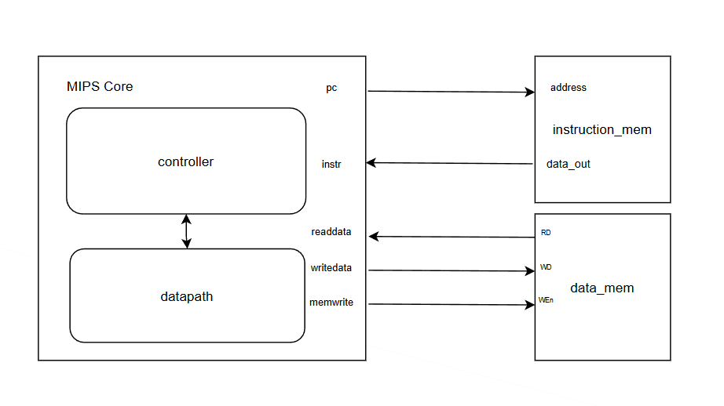
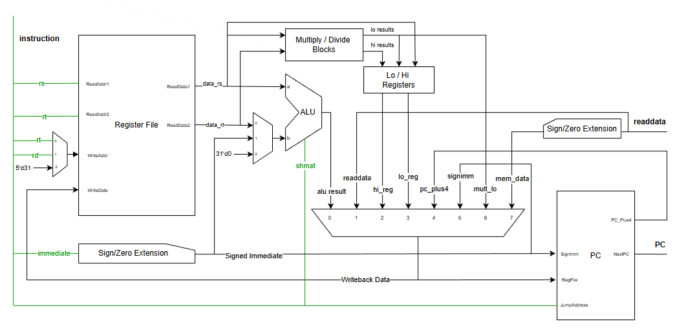

# Phase 1: Single Cycle MIPS Processor
## Block Diagram
# Top 

# Datapath

## Phase Overview
* Instruction Set: Supports 47 instructions from the MIPS ISA (including R-type, I-type, and J-type).
* Target Hardware: Fully synthesized on the Intel/Terasic DE1-SoC (Cyclone V FPGA).
* Performance: Achieved a Maximum Frequency ($F_{max}$) of 59.35 MHz.
> **Note:** Timing analysis excludes the `div` instruction to maintain a higher clock frequency. 
## Verification
A robust SystemVerilog environment was utilized to ensure architectural integrity and functional correctness:

* Object-Oriented Infrastructure: Built using a dedicated MIPS ISA Package and a randomized Instruction Class for flexible stimulus generation.
* Assertion-Based Scoreboard: Automated checking via SystemVerilog Assertions (SVA) to validate register file updates and memory transactions in real-time.
* Directed Testing: Successfully validated the core through a tiered test suite: [`Test_1`,..., `Test_5`].
## Plan
### Phase 1 Part 1
* Implement 10 instructions (`lw`, `sw`, `beq`, `addi`, `j`, `add`, `sub`, `and`, `or`, `slt`).
* Verify the functionality of the implemented instructions by running the `Direct Test_1` program.
* Synthesis on DE1 SoC development board and test the program manually on the Evaluation kit.

### Phase 1 Part 2
* Implement lo,hi registers and mul,div modules with all necessary modifications.
* Implement 26 additional instructions (all remaining instructions excepted the unsigned instruction,Load/Store Instructions,`syscall`,`break`).
* Verify the functionality of the implemented instructions by Creating System Verilog Testbench with MIPS ISA Package and MIPS Instruction Class.

### Phase 1 Part 3
* Implement Unsigned instructions.
* Implement Load Instruction Variations.
* Verify the functionality of the implemented instructions by building MIPS ISA Assertion-based Scoreboard.
* Verify the functionality of the implemented instructions by running the `[Test_1,..,Test_5]`Direct testing program.
* Synthesis on DE1 SoC development board and test the program manually on the Evaluation kit.

## Post Phase 1
- Multiplier/Divsion
    - [ ] Create unsigned/signed multiplication.
    - [ ] Create unsigned/signed division.
    - [ ] run `[Test_6]`
    - [ ] try to see how to improve the division performance by pipelining.

# Phase 2: Pipelined MIPS Processor
## Design with Early Branch Prediction
### Block Diagram

### Phase Overview
* implementation of Functional Pipelined MIPS Core and Solve all the appeared Hazards.
* implementation of Early Branch Decision Hardware,predicting branch is not taken.
* Verify the functionality of the implemented instructions by running the `[Test_1,..,Test_5]`Direct testing program.
### Performance:
* Achieved a Maximum Frequency ($F_{max}$) of 51.07 MHz.
* This is slower than single Cycle.
* *Reason*: Long combinational Chain due to Early branch Detection Logic.
` Register File -> Decode Bypass -> Early Detection -> Controller -> Hazard Unit -> d2e_reg Flush Signal`
* *Solution*: Implement 2-bit Branch Predictor in Fetch Stage.

## Plan
### Phase 2 Part 1
* Implement the pipelined MIPS and solve all occurred hazards in pipeline.
* Implement the early branch decision hardware for branching, predicting branch is not taken.
* Verify the functionality of the implemented instructions by running the `[Test_1,..,Test_5]`Direct testing program.

### Phase 2 Part 2
* Implement the coprocessor0 to handle exceptions, considering its instructions in `Appendix B`.
* Apply 2-bit dynamic branch prediction for branches, verifying using this shown code `[Test_7]`.
* Integrate coprocessor0 and branch predictor to MIPS project.

### Phase 2 Part 3
* Implement the coprocessor0 to handle exceptions, considering its instructions in `Appendix B`.
* Integrate coprocessor0 to MIPS project.

# Phase 3: SoC Phase
* Implement MIPS-AHB Bridge.
* Implement AHB Decoder.
* Implement AHB Bus Matrix.
* Test with repective testbenchs.

# Phase 4: Verification Phase 
* Do Necessary Modifications on MIPS ISA Assertion-based Scoreboard.
`OR` Apply MIPS ISS as Golden Model.
* Make Coverage Plan for the project.
* Verify using Randomized UVM environment.

# Phase 5: ASIC Phase
* Implement the Project on ASIC with selected Node.
* Apply Power Management system on SoC. 

